# Cerberus: The Three-Headed AI Guardian ( MVP )
### *A Proactive Cyber Defense Grid for Kenya’s Public Sector*

> *“Where others build walls, Cerberus builds traps. Where others wait for breaches, Cerberus turns attackers into intelligence sources.”*

---

## 📖 Introduction

Cerberus is an AI-powered, deception-first cyber defense platform designed to protect Kenyan government institutions from phishing, credential theft, and Business Email Compromise (BEC). Inspired by Greek myth, Cerberus has **three heads** — each a specialized AI engine working in concert to detect, engage, and learn from attackers **before** real harm occurs.

Unlike traditional reactive tools, Cerberus **proactively deceives** adversaries:  
. A phishing click spawns a unique, ephemeral decoy environment  
. High-risk logins are *trapped* — not just flagged  
. Every attacker action generates actionable intelligence  
. Real users receive immediate, accessible alerts  

Built by a student team (2nd-year CS + 4th-year SE), Cerberus is **eligible for 7 hackathon categories**, including *Best Overall*, *Best Rookie*, and *Best Female Participant*.

---

## 🧠 Architecture Overview

```mermaid
graph LR
    A[Phishing Click] --> B[Head 1: Decoy Engine]
    B -->|Spawns| C[Fake Login / Portal]
    C --> D[Captures Fake Credentials]
    C --> E[Tracks Page Visits]
    D & E --> F[SQLite Telemetry DB]

    G[Credential Login] --> H[Head 2: Credential Sentinel]
    H -->|Biometrics + Context| I[Risk Score: 0–100]
    I -->|High Risk| B
    I -->|Medium| J[SOC Alert]
    I -->|Low| K[Allow]

    F --> L[Head 3: BEC Assassin]
    L -->|NLP + Graph Analysis| M[Email Threat Detection]
    M --> F

    F & J --> N[Real-Time WebSocket Alerts]
    F --> O[PDF Attacker Reports]
    N & O --> P[SOC Dashboard]
```


## 🔍  How It works 

Decoy Engine creates UUID-based sessions on phising clicks 
Credential Sentinel analyzes typing speed, IP, time -> risk_score
High-risk login -> auto-redirects to decoy ( action: "trap" )
All telemetry -> SQLite -> Realtime alerts + PDF reports
SOC sees live attacker paths, credentials (fake), dwell tie.
 
🚀 Installation (End Users)

Deploy Cerberus in minutes — ideal for pilot ministries or SOC evaluation.
Prerequisites

    Python 3.9+  
    git, pip, venv

Steps
1. Clone & setup
```bash
git clone https://github.com/Ramsey-Javan/cerberus-defense-suite.git
cd cerberus-defense-suite/backend
```

2. Create virtual environment
```bash
python -m venv venv
source venv/bin/activate  # Linux/macOS
# venv\Scripts\activate   # Windows
```

3. Install dependencies
```bash
pip install -r requirements.txt
```

4. Initialize database
```bash
python -c "from app.decoy.storage import init_db; init_db()"
```

5. Start server
```bash
uvicorn app.main:app --host 0.0.0.0 --port 8000
```

## 🛠️ Contribution Guide
We welcome contributors — especially students passionate about cybersecurity.
### ✅ Do

- Work on `dev` branch → PR to `main`
- Write clear commit messages (`feat:`, `fix:`, `docs:`)
- Include tests for new logic
- Follow PEP 8 (use `black` formatter)
- Add accessibility features (screen-reader support, high-contrast)

### ❌ Don't

- Commit `.pyc`, `__pycache__/`, or `decoy_sessions.db`
- Push secrets or real credentials
- Modify `main` directly — always PR
- Ignore `.gitignore` (we use it strictly)

## 📋 How to Contribute

1. Fork the repo
2. Create feature branch: `git checkout -b feat/bec-assassin`
3. Code → test → commit
4. Push → open PR with description & screenshots
5. Tag @Ramsey-Javan for review

## 🌟 Contributor Expectations

| Role | Expectations | Recognition |
|------|--------------|-------------|
| Core Dev | Build new heads, fix critical bugs | Co-author on publications, prize share |
| Frontend | SOC dashboard (React), decoy UI polish | Lead frontend in finals demo |
| Security | Threat model, penetration test | NCSS mentorship recommendation |
| Docs | Tutorials, Swahili translations | Best Documentation internal award |

// ...existing code...

## 🌟 Contributor Expectations

| Role | Expectations | Recognition |
|------|--------------|-------------|
| Core Dev | Build new heads, fix critical bugs | Co-author on publications, prize share |
| Frontend | SOC dashboard (React), decoy UI polish | Lead frontend in finals demo |
| Security | Threat model, penetration test | NCSS mentorship recommendation |
| Docs | Tutorials, Swahili translations | Best Documentation internal award |

## ⚠️ Known Issues & Roadmap

| Issue | Status | Target |
|-------|--------|--------|
| PDF generation fails on empty password | ✅ Fixed (v1.2.1) | Released |
| WebSocket reconnect logic | 🟡 In progress | v1.3 |
| BEC Assassin (Head 3) | 🔵 Planned | Q1 2026 |
| Docker Compose deployment | 🟡 Testing | v1.4 |
| Swahili alert localization | 🔵 Backlog | v2.0 |

## Help wanted:  

    Add twilio integration for SMS challenges (BEC)  
    Build React SOC dashboard (live map + alerts)  
    Implement Redis for WebSocket scaling


    ## 💙 Support Cerberus

    Cerberus is open-source and built by students — but defending Kenya's digital future requires resources.

    If you believe in proactive, intelligence-driven cybersecurity:

    ### 🇰🇪 Donate to the Team

    Help us attend finals, buy domain/SMS credits, and scale to county governments.

    📧 **Contact:** javan.ramsey@students.niru.ac.ke

    > All funds go toward Cerberus development — receipts published monthly.

    ---

    **Cerberus Defense Suite** • *AI for National Prosperity*  
    🇰🇪 Built in Nairobi • Protecting Kenya's Digital Future
